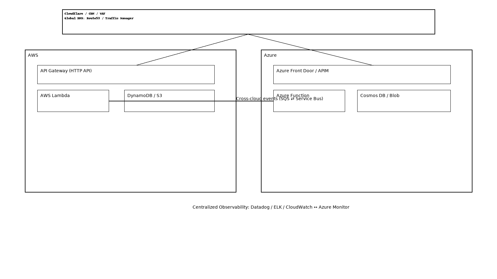

# 🏗️ Multi-Cloud Active-Active Deployment

## 📘 Overview  
This project demonstrates an **active-active multi-cloud architecture** leveraging **AWS** and **Azure** to achieve **high availability**, **resilience**, and **disaster recovery**.  
It automates infrastructure deployment and synchronization across both clouds using **Terraform**, **CI/CD pipelines**, and **serverless components**.

---

## 🌐 Architecture Summary
- **Cloud Providers:** AWS & Azure  
- **Infrastructure as Code:** Terraform  
- **Automation / CI-CD:** YAML pipelines (Azure DevOps or GitHub Actions)  
- **Application Layer:** Node.js (Lambda & Azure Function)  
- **Storage Layer:** Cross-cloud data synchronization (S3 ↔ Azure Blob)  
- **Networking:** Load balancing and DNS-based failover  
- **Monitoring:** Cloud-native metrics and alerting  

---

## ⚙️ Tech Stack

| Component | Technology Used |
|------------|------------------|
| Infrastructure | Terraform |
| CI/CD | GitHub Actions / Azure DevOps |
| Compute | AWS Lambda / Azure Functions |
| Language | Node.js |
| Storage | AWS S3 / Azure Blob |
| Monitoring | CloudWatch / Azure Monitor |

---

## 🚀 Deployment Steps

### 1. Clone the repository

### 2. Configure environment variables

### 3. Deploy Infrastructure

### 4. Run Application

### 5. Trigger CI/CD

